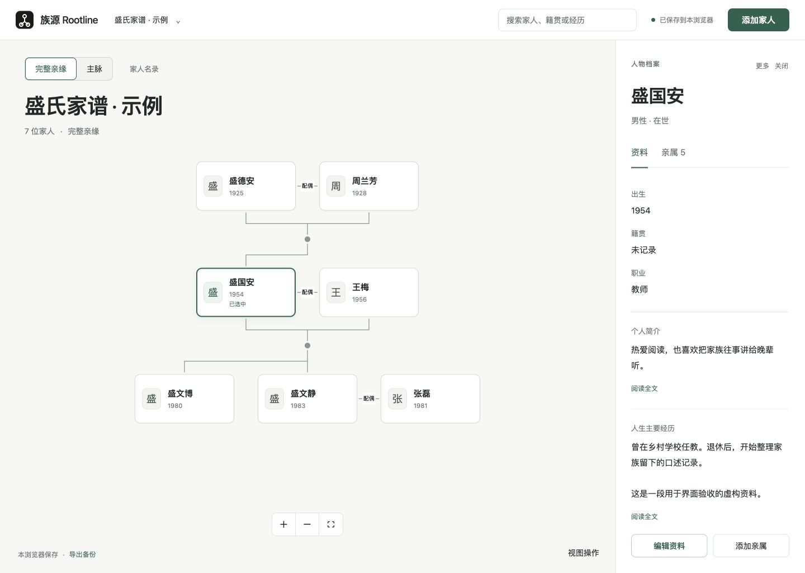

# Rootline 界面设计与实现

更新：2026-09-08。当前采用浅色家谱画布与右侧人物档案方案；下图为真实浏览器截图，人物均为虚构验收资料。

## 信息结构

- 顶部：原有品牌标识、族谱与数据菜单、全局人物搜索、明确的本浏览器保存状态、添加家人。
- 画布：完整亲缘/主脉切换、家人名录、当前族谱名称、人物节点、缩放与适配、备份入口。
- 档案：选中人物后出现；资料与亲属分栏切换，简介与经历进入独立阅读视图，编辑与添加亲属固定在面板底部。
- 手机：搜索保留；详情成为底部面板，画布留出相应空间。完整家谱适配以概览为主，查看细节可缩放、搜索定位或打开名录。

## 视觉系统

暖灰白画布、白色资料面板、墨绿色操作和选中状态。使用系统字体，不下载外部字体。顶部 72px，桌面资料面板 340px，人物卡片 178×88px。姓名、基础资料、长文分级呈现。节点不再按性别分配蓝粉底色。

使用已有 rootline-mark.svg；生成图中的临时字标不替代正式标识。概念图的错误亲缘线也不作为实现依据，连线仍完全由领域布局器和独立关系数据生成。

## 交互与数据保护

搜索会展开遮挡目标的分支；只有主脉确实排除目标时才切换完整亲缘。选择人物不重新计算整张图的布局。缩放适配给控制条和标题保留空间；阅读与编辑对话框保留焦点管理。

保存操作检查 IndexedDB 内部修订号。其他窗口已保存新版本时拒绝旧窗口写入。读取最新版本会明确放弃本次编辑并关闭对话框，重新编辑从最新资料开始。导入的恢复点与替换写入在同一事务完成；失败时一起回滚。内部修订号不写入 JSON/Excel 交换数据。

## 验收材料

- [设计验收记录](../design-qa.md)
- [源图与实现对照](redesign/comparison.png)
- [手机界面](redesign/mobile.png)
- [阅读视图](redesign/reader.png)

本轮未新增账号、云同步、多配偶支持或生产部署。浏览器清理仍会删除本地族谱及恢复点，需定期导出备份。
